# BSDL Image Tests

| Test | Reference |
| --- | --- |
| simple-diffuse |  |
| simple-diffuse-furnace |  |
| oren-nayar |  |
| oren-nayar-furnace |  |
| oren-nayar-translucent |  |
| oren-nayar-translucent-furnace |  |
| toon-diffuse |  |
| toon-diffuse-furnace |  |
| toon-translucent |  |
| toon-translucent-furnace |  |
| metal |  |
| metal-furnace |  |
| dielectric |  |
| dielectric-furnace |  |
| thinlayer |  |
| thinlayer-furnace |  |
| toon-dielectric |  |
| toon-dielectric-coat | 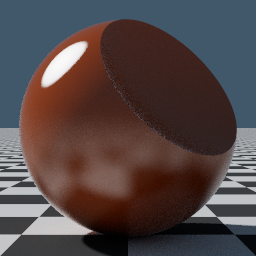 |
| toon-dielectric-furnace |  |
| clearcoat |  |
| clearcoat-furnace |  |
| sheen |  |
| sheen-furnace |  |
| sheen-ltc |  |
| sheen-ltc-furnace |  |
| mtx-burley-diffuse | 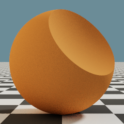 |
| mtx-burley-diffuse-furnace |  |
| mtx-conductor | 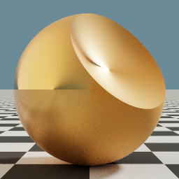 |
| mtx-conductor-furnace |  |
| mtx-dielectric | 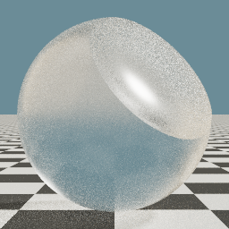 |
| mtx-dielectric-coat | 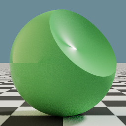 |
| mtx-dielectric-furnace |  |
| mtx-oren-nayar-diffuse | 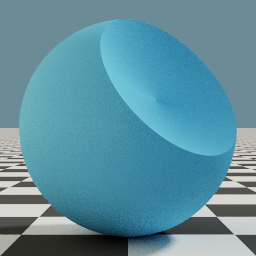 |
| mtx-oren-nayar-diffuse-furnace |  |
| mtx-generalized-schlick | 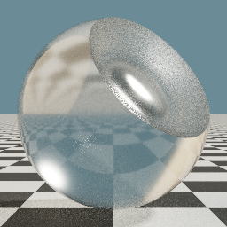 |
| mtx-generalized-schlick-coat | 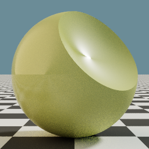 |
| mtx-generalized-schlick-furnace | 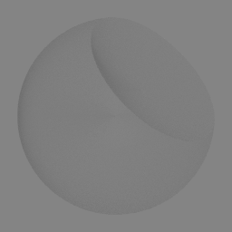 |
| mtx-sheen | 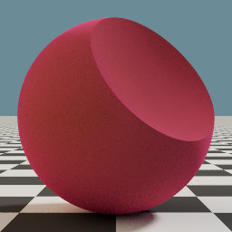 |
| mtx-sheen-furnace |  |
| mtx-sheen-zeltner | 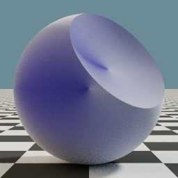 |
| mtx-sheen-zeltner-furnace |  |
| mtx-translucent | 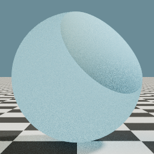 |
| mtx-translucent-furnace |  |
